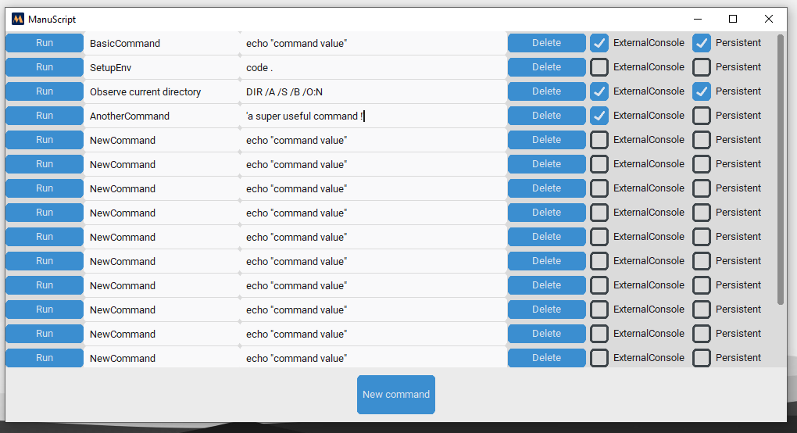
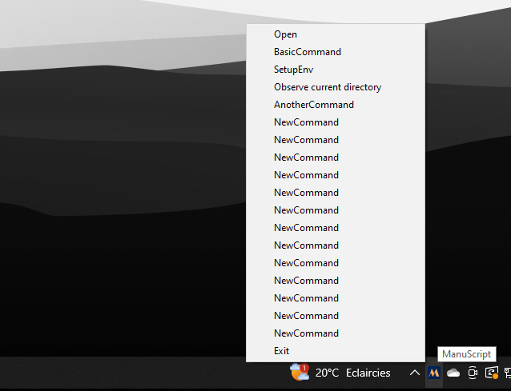

# ManuScript
SystemTray Application for quick launch operations and commands on Windows.
Use CustomTkinter : https://github.com/TomSchimansky/CustomTkinter

You can create commands (name, value)
For now there are only two options : 
- ExternalConsole : Open the terminal and execute the command in it.
- Persistent : Make the terminal persistent after the command ended (if checked, ExternalConsole is automatically true)



When you close the windows, it put the application in the System Tray icons. From here you can still Open the window and execute any command you created.



## Run

```
Install the dependencies : customtkinter, pystray

$ python main.py
```

An executable will come soon with the repository so that it is more convenient to use.